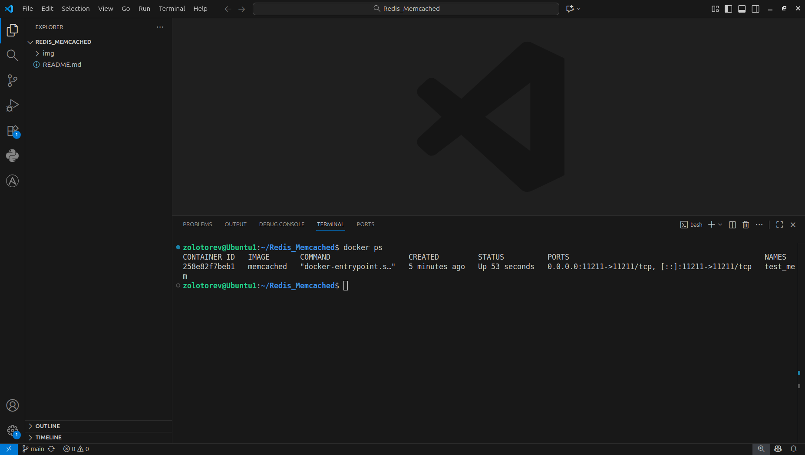
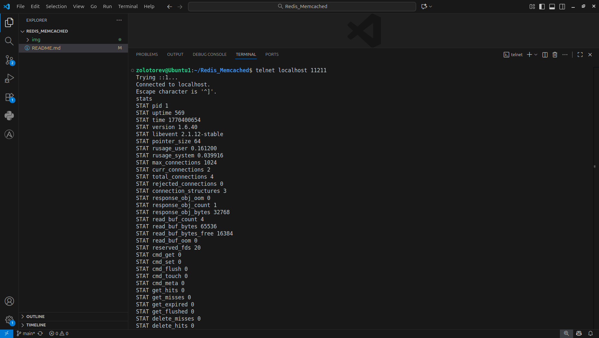
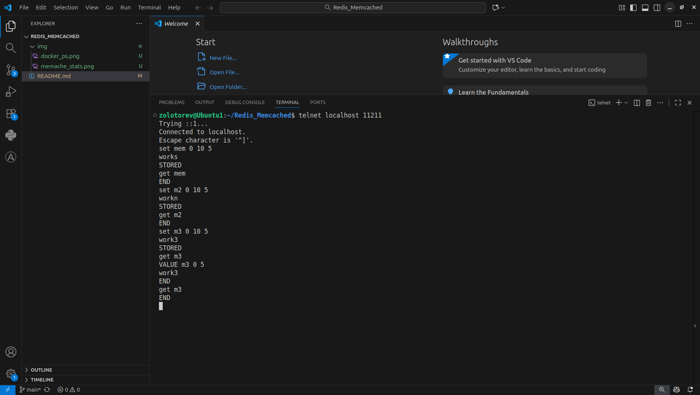
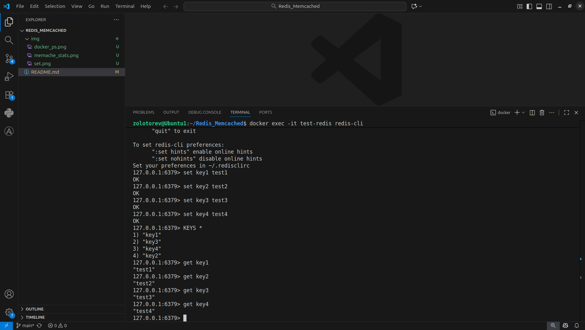

# Домашнее задание к занятию «Кеширование Redis/memcached»
### Золоторев Н.Д.

### Задание 1. Кеширование

Приведите примеры проблем, которые может решить кеширование.

Приведите ответ в свободной форме.

### Решение 1.

- Высокая нагрузка на БД
- Нестабильная работа при пиковых нагрузках
- Избыточные запросы к редко меняющимся данным
- Медленные ответы при географически распределённых пользователях
- Ускорение времени отклика

Кэширование снижает нагрузку на базу данных, ускоряет работу приложения и улучшает пользовательский опыт.

### Задание 2. Memcached

Установите и запустите memcached.

Приведите скриншот systemctl status memcached, где будет видно, что memcached запущен.
ыны
### Решение 2

### Задание 3. Удаление по TTL в Memcached

Запишите в memcached несколько ключей с любыми именами и значениями, для которых выставлен TTL 5.

Приведите скриншот, на котором видно, что спустя 5 секунд ключи удалились из базы.

### Решение 3.

### Задание 4. Запись данных в Redis

Запишите в Redis несколько ключей с любыми именами и значениями.

Через redis-cli достаньте все записанные ключи и значения из базы, приведите скриншот этой операции.

### Решение 4.

